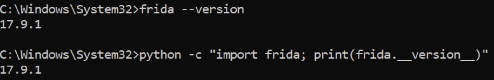
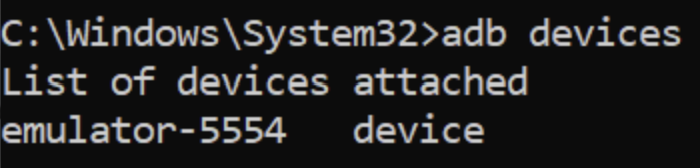
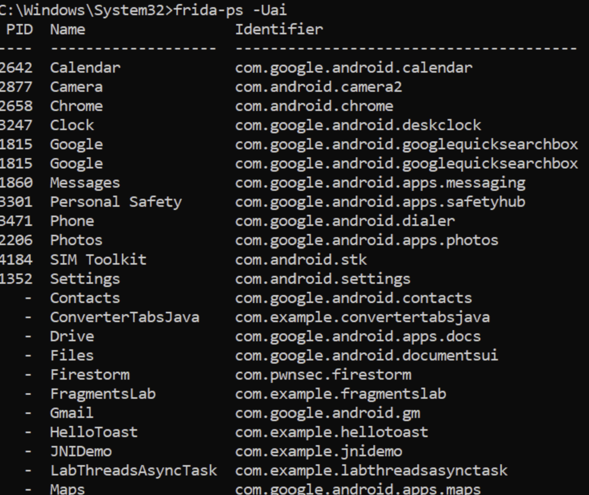
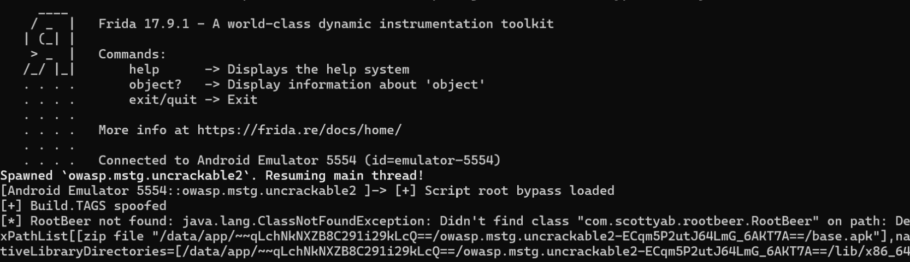
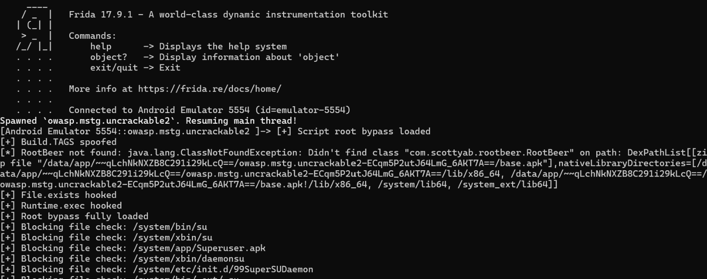
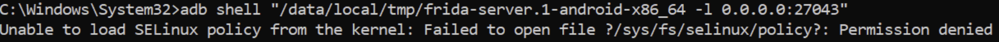

# LAB 11 – Bypass de la Détection de Root Android avec Frida (Hooks Java & Natif)

**Auteur :** Oumayma Benhilal  
**Cours :** Sécurité des applications mobiles  

## Objectifs pédagogiques
- Comprendre comment les apps Android détectent le root (Java et natif).
- Utiliser Frida pour neutraliser ces détections via des hooks Java et, si nécessaire, natifs.
- Lancer l’app cible sous Frida, vérifier que la détection est contournée, et diagnostiquer les échecs.

> **Avertissement éthique** : n’utilisez ces techniques que sur des applications/appareils pour lesquels vous avez une autorisation explicite. Ce lab est purement pédagogique et orienté sécurité défensive.

## Prérequis
- Émulateur Android rooté ou appareil physique rooté
- Frida installé et `frida-server` déployé sur l’appareil
- Application cible (exemple : `owasp.mstg.uncrackable2` ou application équivalente)
- ADB configuré

---

## Rappel express — Démarrer frida-server sur Android
Avant de commencer, il est indispensable de s'assurer que Frida et `adb` sont bien configurés. 



Le serveur doit être lancé en tâche de fond sur l'appareil :
```bash
adb shell
su
/data/local/tmp/frida-server &
```

## Panorama rapide des techniques de détection de root
Les applications utilisent différentes méthodes pour détecter un environnement compromis :
- **Recherche de fichiers** : `/system/bin/su`, `/system/app/Superuser.apk`, `/sbin/su`, etc.
- **Vérification de propriétés système** : `ro.debuggable`, `ro.build.tags` (test de `test-keys`).
- **Commandes système** : exécution de `which su`.
- **Détection d'applications spécifiques** : Magisk, SuperSU.
- **Détections natives (C/C++)** : utilisation de `fopen()`, `stat()`, ou `access()` directement via `libc.so` pour contourner les hooks Java.

---

## Déroulement du Lab

### Étape 1 – Démarrage et repérage du package
La première étape consiste à identifier le nom du package cible sur l'appareil. Nous utilisons la commande `frida-ps -Uai` pour lister toutes les applications installées et trouver notre cible (ici `owasp.mstg.uncrackable2`).


### Étape 2 – Script Frida (bypass Java) prêt à l’emploi
Nous préparons un script JavaScript (ex: `bypass.js`) qui intercepte les appels Java classiques de détection de root :
- `File.exists()` pour masquer les chemins vers les binaires `su`.
- `Runtime.exec()` pour bloquer les commandes shell.
- `android.os.Build.TAGS` pour spoofer la valeur de `test-keys`.

### Étape 3 – Ajouter des hooks natifs (C/C++)
Si l'application utilise du code natif (JNI) pour vérifier la présence de fichiers root avec `fopen` de `libc.so`, nous devons ajouter un `Interceptor.attach` dans notre script :
```javascript
Interceptor.attach(Module.findExportByName("libc.so", "fopen"), {
    onEnter: function(args) {
        var path = Memory.readUtf8String(args[0]);
        if (path.indexOf("su") !== -1) {
            console.log("[+] Hook natif : Blocage de fopen sur " + path);
            // On peut remplacer le pointeur pour pointer vers un fichier inexistant
        }
    }
});
```

### Étape 4 – Masquer quelques anti-Frida basiques
Certaines applications scannent la mémoire pour détecter `frida:rpc` ou le port par défaut (27042). Il est parfois nécessaire de renommer le processus `frida-server` ou d'utiliser le mode _embedded_ avec `frida-gadget`.

### Étape 5 – Méthodes de lancement et Validation
Nous lançons notre script Frida en injectant le bypass dès le démarrage (`spawn`) de l'application :
```bash
frida -U -f owasp.mstg.uncrackable2 -l bypass.js --no-pause
```
La console affiche le succès des hooks. Les vérifications `File.exists` et `Build.TAGS` sont neutralisées et les chemins bloqués apparaissent dans les logs.



L'application cible se lance normalement, l'alerte de root est contournée avec succès.

---

## Dépannage (FAQ)

- **Permission Denied ou SELinux bloquant** : Lors du lancement de `frida-server` sur certains terminaux ou émulateurs, SELinux peut bloquer l'exécution.
  
  *Solution* : Passez SELinux en mode permissif avec `adb shell su -c "setenforce 0"`.
- **Application qui crash (Failed to spawn)** : Vérifiez que l'application est bien compatible avec l'architecture de l'émulateur et que votre script JS ne contient pas d'erreurs de syntaxe qui font planter le thread principal.

## Bonnes pratiques
- **Environnement isolé** : Utilisez un émulateur ou un appareil dédié (jamais votre téléphone personnel).
- **Nettoyage** : Tuez toujours `frida-server` une fois le test terminé.
```bash
adb shell "killall frida-server"
```

## Conclusion personnelle
Ce lab met en lumière le jeu du chat et de la souris entre les développeurs et les analystes en sécurité. Si bypasser les sécurités Java est relativement aisé avec Frida, l'ajout de détections natives et de contrôles anti-Frida complexifie largement la tâche. Cela souligne l'importance d'une défense en profondeur (obfuscation, RASP) pour les applications critiques.

[Lien vers le dépôt GitHub](https://github.com/Oumaymaa659/LAB-11-Bypass-de-la-D-tection-de-Root-Android-avec-Frida)
